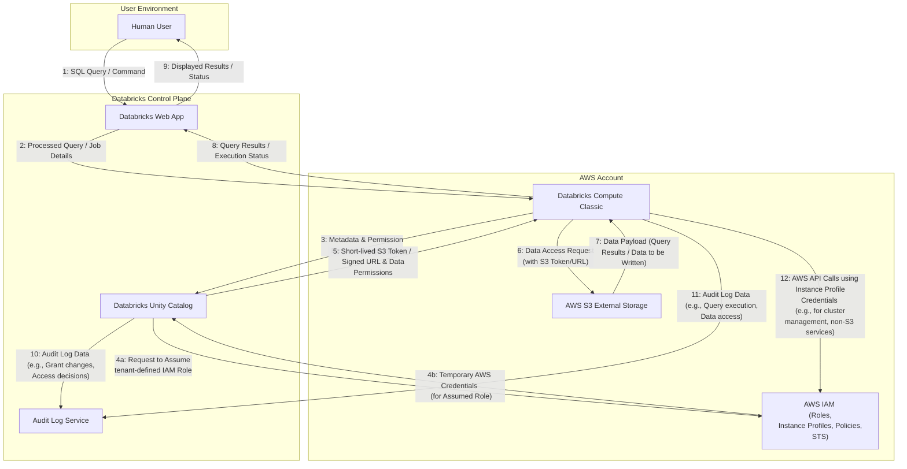

# Threat model template: Databricks Unity Catalog on AWS data access

## Section 1: Introduction

### 1.1 Purpose

To identify, analyze, and propose mitigations for potential security threats to a generic "Databricks Unity Catalog on AWS Data Access" system, focusing on ensuring the confidentiality, integrity, and availability of managed data.

### 1.2 System overview

The "Databricks Unity Catalog on AWS Data Access" system enables authenticated human users to execute SQL queries and run code (which might create, read, modify, or delete data) over structured business data. This data may include sensitive information such as PII subject to GDPR, and is stored in external S3 buckets on AWS independently of Databricks. The system leverages Databricks Unity Catalog for centralized data governance, metadata management, and access control. Compute resources run under the classic Databricks model, meaning they are provisioned within the AWS account.

### 1.3 Scope

#### In scope:
* The Databricks web user interface.
* Databricks infrastructure components directly involved in the query lifecycle with Unity Catalog.
* Relevant AWS components, including S3 for external storage and IAM for roles and instance profiles.
* Mechanisms for human user authentication to Databricks as they pertain to data access.
* Data access flows for queries originating from human users via SQL or programming languages.

#### Out of scope:
* Access by external systems (beyond human users interacting with Databricks).
* The detailed processes for how data is initially sourced into the external S3 buckets.
* Specific vulnerabilities within the underlying Databricks or AWS services, unless directly exploitable through the defined data access patterns. (We will assume these platforms provide their stated security features, and focus on their configuration and use).

### 1.4 Key assumptions
* Users are already authenticated to the Databricks environment before attempting data access operations governed by Unity Catalog. (The specifics of this initial authentication are not the primary focus, but the authenticated identity is the input to Unity Catalog's decisions).
* The AWS platform is built and operated according to industry best practices. See [AWS shared sponsibility model](https://aws.amazon.com/compliance/shared-responsibility-model/).
* The Databricks platform is built and operated according to industry best practices. See [Databricks' Security and Trust center](https://www.databricks.com/trust/trust).
* The AWS environment and the Databricks control plane are configured according to their respective best practices, except where we might identify specific configuration-related threats. See [Databricks Security Best Practices on AWS](https://www.databricks.com/trust/security-features/best-practices).
* Data at rest in S3 is encrypted (details of encryption can be explored as a mitigation or existing control).

## Section 2: system architecture overview

The following Data Flow Diagram (DFD) illustrates the key components, system boundaries, and data flows for the "Databricks Unity Catalog on AWS Data Access" system.

### 2.1 Assets
The most valuable assets within this system are:
* The **data stored in `awsS3ExternalStorage`**, particularly the "external tables" which represent raw source system data.
* This data may include **PII under GDPR regulation**, making its confidentiality and integrity paramount.

## Section 3: identified threats and mitigations

We will use the STRIDE framework as a guide to identify threats. For each threat, we will assess its Likelihood and Impact to determine an overall Risk level.

|Threat ID|Threat Description|Affected Asset(s) or Flow(s)|STRIDE Category|Potential Impact|Assessed Likelihood|Assessed Risk|Agreed Mitigations & Controls|Status of Mitigation|
|:---|:---|:---|:---|:---|:---|:---|:---|:---|
|T001|An attacker gains unauthorized read access to sensitive PII/GDPR data stored in `awsS3ExternalStorage` by exploiting misconfigured S3 bucket policies or ACLs, potentially bypassing some Unity Catalog intended controls.|Data in `awsS3ExternalStorage` (External Tables, raw source data including PII/GDPR)|Information Disclosure|TBC|TBC|TBC|**Potential Mitigations to Consider:** - Peer review of changes. - Policy-as-Code (PaC). - Automated Configuration Scanning & Monitoring. - Strict Enforcement of S3 Block Public Access (BPA). - Adherence to the Principle of Least Privilege. - Preventive Guardrails with AWS Service Control Policies (SCPs). - Regular Dedicated Security Audits.|*To be determined per implementation*|
|T002|Short-lived S3 tokens or signed URLs, vended by Unity Catalog to `databricksComputeClassic`, are intercepted or leaked from the compute environment (e.g., through compromised compute resources, logs, or an insecure intermediary process). This could allow an attacker to replay these credentials to directly access S3 data within the token's scope and expiry window, bypassing other Databricks controls.|Flow 5, Credentials (S3 tokens/signed URLs), Data in `awsS3ExternalStorage`|Information Disclosure / Elevation of Privilege|TBC|TBC|TBC|**Potential Mitigations to Consider:** - Implement Strict Network Egress Controls. - Ensure Shortest Practical Token Lifetime. - Audit and Monitor S3 Access Patterns for anomalies. - Harden the Databricks Compute Environment. - Use Enhanced Security Monitoring.|*To be determined per implementation*|
|T003|The tenant-defined IAM role that Databricks Unity Catalog assumes to access S3 (and potentially other services) is overly permissive. If Unity Catalog's mechanisms for generating fine-grained credentials were ever flawed, or if an attacker found a way to abuse the assumed role session within Unity Catalog, these excessive permissions could be exploited.|Flow 4a/4b, `awsIAM` (tenant-defined Role), all data/services accessible by the overly permissive role.|Elevation of Privilege|TBC|TBC|TBC|**Potential Mitigations to Consider:** - Strict Application of the Principle of Least Privilege (PoLP). - Policy-as-Code (PaC) with Peer Review. - Implement an IAM Permissions Boundary. - Automated Monitoring and Auditing of the IAM Role. - Regular Dedicated Security Audits.|*To be determined per implementation*|
|T004|The IAM Instance Profile attached to the EC2 instances within `databricksComputeClassic` is overly permissive. If a compute node is compromised, an attacker could leverage these excessive instance profile permissions to escalate privileges or exfiltrate data outside of Databricks controls.|`databricksComputeClassic`, `awsIAM` (Instance Profile), any AWS resources/services accessible by the instance profile.|Elevation of Privilege|TBC|TBC|TBC|**Potential Mitigations to Consider:** - Strictly Enforce Least Privilege for the Profile's Policy. - Use Policy-as-Code (PaC) with Peer Reviews. - Apply an IAM Permissions Boundary. - Regular Auditing and Automated Scanning. - Limit User Code Access to Instance Metadata.|*To be determined per implementation*|
|T005|An attacker with sufficient privileges (e.g., a compromised administrative account) tampers with or deletes audit logs stored in the `AuditLogService`. This action could hide malicious activities, obstruct forensic investigations, and allow attackers to deny their actions, undermining accountability.|`AuditLogService`, Flows 10 & 11 (Audit Log Data).|Tampering / Repudiation|TBC|TBC|TBC|**Potential Mitigations to Consider:** - Enable S3 Object Lock on the Log Bucket. - Use a Dedicated, Cross-Account Log Archive. - Apply Strict, Least-Privilege S3 Bucket Policies. - Enable MFA Delete. - Configure Monitoring and Alerting on the Log Bucket.|*To be determined per implementation*|
|T006|Malicious code is introduced via a compromised software package. For **Python/Scala packages**, this means arbitrary code execution on compute nodes, leading to credential theft, network data exfiltration, or malware installation. For **dbt packages**, the risks are primarily data-oriented and executed via malicious SQL within macros, including: - **Data Exfiltration:** Copying sensitive data to other tables. - **Data Tampering:** Altering or deleting data with `UPDATE` or `DELETE` commands. - **Privilege Escalation:** Running `GRANT` statements to give the attacker unauthorized permissions.|`databricksComputeClassic`, Data in `awsS3ExternalStorage`, Credentials (Flow 5).|Tampering, Information Disclosure, Elevation of Privilege, Denial of Service|TBC|TBC|TBC|**Potential Mitigations to Consider:** - Use a Private, Curated Package Repository (for Python/Scala). - Use Private Git Repositories for dbt Packages. - Automated Dependency Scanning (for Python/Scala). - Mandatory Manual Code Review for dbt Packages. - Enforce Library Installation with Cluster Policies. - Apply Network Egress Controls.|*To be determined per implementation*|
|T007|A `HumanUser` interacts with the `DatabricksWebApp` using a compromised end-user computing device (e.g., malware, unpatched OS/browser). This could lead to session hijacking, credential theft, or unauthorized actions.|`HumanUser`, `DatabricksWebApp`, User's Databricks session/credentials, Flow 1, Flow 9.|Spoofing, Tampering, Information Disclosure|TBC|TBC|TBC|**Potential Mitigations to Consider:** - Enforce Use of Managed and Secured Endpoints. - Implement Conditional Access Policies. - Enforce Strong, Phishing-Resistant Authentication (Passkeys, MFA). - Use IP Access Lists. - User Security Awareness Training.|*To be determined per implementation*|
|T008|An attacker (e.g., a malicious authenticated user) intentionally consumes excessive compute resources, leading to a denial of service for other legitimate users and jobs.|`databricksComputeClassic`, availability of data processing for legitimate users.|Denial of Service|TBC|TBC|TBC|**Potential Mitigations to Consider:** - Implement and enforce Cluster Policies to limit resource consumption. - Use job and pool configurations to isolate workloads. - Configure monitoring and alerting for abnormal resource utilization. - Run the open-source Databricks Security Analysis Tool (SAT) periodically to detect clusters lacking resource-limiting policies.|*To be determined per implementation*|

## Section 4: other operational considerations & accepted risks

This section outlines other operational security considerations relevant to the "Databricks Unity Catalog on AWS Data Access" system and documents any risks that have been formally accepted.

### 4.1 Operational considerations
* *(To be discussed. This may include items such as data backup and recovery procedures specific to the external tables, incident response playbooks for data breaches involving this data, security awareness training for users, ongoing monitoring requirements, etc.)*

### 4.2 Accepted risks
* *(No risks have been formally accepted at this stage. Risk acceptance will be documented here if, after assessment and consideration of potential mitigations, a decision is made to accept a specific risk.)*

## Section 5: Conclusion

### 5.1 Summary of exercise

This threat modeling exercise for the "Databricks Unity Catalog on AWS Data Access" system has so far involved:
* Defining the scope, primary purpose, and key components of the system.
* Developing a Data Flow Diagram (DFD) to illustrate the system architecture and data flows.
* Identifying key assets, notably the sensitive PII/GDPR data stored in external S3 buckets.
* Initiating the threat identification process using the STRIDE framework, resulting in a preliminary list of potential threats with initial impact assessments. Several threats have had their likelihood and overall risk levels assessed, while others require further information.
* Enumerating a comprehensive list of potential mitigation strategies and controls for each identified threat, forming a reusable template for this architecture.

The identified threats cover areas such as direct storage misconfigurations, credential security, permissions management for IAM roles and instance profiles, audit logging integrity, software supply chain vulnerabilities, and end-user device security.

### 5.2 Recommendations for ongoing review & next steps

To ensure the continued security of the "Databricks Unity Catalog on AWS Data Access" system, the following are recommended:

* **Complete Likelihood and Risk Assessment:** Gather the necessary information to finalize the likelihood and overall risk assessment for threats T002, T006, and T007.
* **Mitigation Planning:** Proceed to Phase 4 to brainstorm, evaluate, and agree on mitigation strategies for all threats rated as Medium risk or higher. Document these mitigations and their implementation status in Section 3 of this document.
* **Revisit Accepted Risks:** If any risks are formally accepted after mitigation analysis, ensure they are documented in Section 4.2.
* **Regular Review:** This threat model should be treated as a living document. It should be reviewed and updated periodically (e.g., annually, or upon significant changes to the system architecture, data sensitivity, or the threat landscape).
* **Integrate with Security Practices:** Ensure that findings and mitigations from this threat model are integrated into ongoing security operations, including monitoring, incident response, and vulnerability management processes.
* **Address Operational Considerations:** Populate Section 4.1 with relevant operational security considerations as they are identified or implemented.

This exercise has laid the groundwork for a more comprehensive understanding and management of security risks associated with this system. The next crucial steps involve defining and implementing appropriate mitigations and establishing a cycle of continuous review.

## Appendix A: Threat model considerations for serverless compute

This appendix analyzes the changes to the threat model when considering the use of Databricks Serverless compute as an alternative to the Classic (tenant-managed VPC) compute model described in the main document. The primary architectural shift is that compute resources no longer run in the tenant's AWS account but in a secure, Databricks-managed environment. This alters the trust boundaries and shared responsibility model.

### Mitigated or modified threats

The adoption of serverless compute directly mitigates or modifies the following threats identified in this threat model:

* **T004 (Overly permissive Compute Instance Profile):** This threat is considered **MITIGATED**. Because compute resources no longer run in the tenant's AWS account, the tenant is no longer responsible for creating or managing IAM instance profiles for them. This eliminates the risk of misconfiguring these specific permissions.
* **T008 (Denial of Service on compute):** This threat is **PARTIALLY MITIGATED**. The nature of the risk shifts from tenant-managed infrastructure availability to service-level availability and cost control. While a malicious query can still consume allocated resources and impact costs, the underlying multi-tenant infrastructure's stability and isolation become Databricks' responsibility to manage.

### New or introduced threats

The shift to a serverless architecture introduces new threat vectors to consider:

1.  **Threat of Insecure Network Connectivity Configuration:** The network connection configured to allow the Databricks serverless environment to access data sources within the tenant's AWS account becomes a critical security boundary. A misconfiguration of this connectivity (e.g., overly permissive private endpoint policies) could expose internal resources.
2.  **Threat of Data Exfiltration from the Serverless Environment:** With the classic model, data egress is controlled via tenant-managed VPC networking. In the serverless model, the tenant relies on Databricks-provided network policies (e.g., a serverless firewall) to control outbound traffic. Misconfiguration of these policies could create a data exfiltration path.
3.  **Threat of Compromise in the Databricks Multi-Tenant Environment:** The tenant now implicitly trusts Databricks to secure the multi-tenant compute plane. A vulnerability in the serverless infrastructure could potentially lead to a cross-tenant compromise, impacting data confidentiality or integrity. This risk is primarily mitigated by Databricks' internal security posture, which should be evaluated via their security and compliance documentation.

### Summary of changes

The following table summarizes the impact of switching from Classic to Serverless compute on the threats identified in this model.

|Threat ID|Threat Description|Impact of Switching to Serverless Compute|
|:---|:---|:---|
|T004|Overly permissive Compute Instance Profile|**Mitigated.** The tenant no longer manages instance profiles for compute.|
|T008|Denial of Service on compute|**Partially Mitigated/Modified.** The threat shifts from infrastructure availability (now Databricks' responsibility) to service availability and cost control.|
|*New*|Insecure Network Connectivity Configuration|**New Threat.** A new attack surface is created at the network boundary between the serverless environment and the tenant's AWS account.|
|*New*|Data Exfiltration from the Serverless Environment|**New Threat.** The method for controlling data egress changes from tenant-managed VPC controls to Databricks-managed serverless network policies.|
|*New*|Compromise in the Databricks Multi-Tenant Environment|**New Threat.** The tenant now relies on Databricks' security to protect the multi-tenant compute plane, introducing a vendor trust risk.|
|T001, T002, T003, T005, T006, T007|Other existing threats|**Unchanged.** These threats relate to tenant-managed resources (S3, IAM roles, user endpoints), code-level risks (packages), or data flows that are conceptually the same in both models.|

