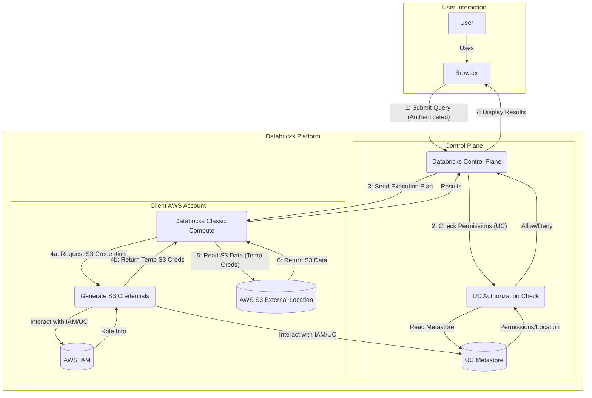

## Data flow diagram

# Threat Analysis & Rating: Data Access DFD (with Component Names)

**(H = High, M = Medium, L = Low)**

| Threat Description                                                | Component(s) Affected                                                                 | STRIDE | Likelihood | Impact | Risk   | Notes                                                                                                |
| :---------------------------------------------------------------- | :------------------------------------------------------------------------------------ | :----- | :--------- | :----- | :----- | :--------------------------------------------------------------------------------------------------- |
| User tricked by phishing site mimicking Databricks                | User, Browser                                                                         | S      | M          | H      | **H** | Common attack vector, potential full account compromise. Relies on user awareness & technical controls. |
| Credential generation grants excessive S3 permissions (EoP)       | P6 (Generate S3 Credentials), P5 (Databricks Classic Compute), DS5 (AWS S3 Ext. Loc.) | E      | M          | H      | **H** | Misconfiguration of UC External Locations or IAM Roles is plausible; undermines data segregation.       |
| Direct S3 modification bypasses UC governance                     | DS5 (AWS S3 External Location)                                                        | T      | M/H        | H      | **H** | Likelihood depends heavily if non-UC S3 access exists. Breaks integrity/lineage.                      |
| Direct S3 access bypasses UC governance                           | DS5 (AWS S3 External Location)                                                        | I      | M/H        | H      | **H** | Likelihood depends heavily if non-UC S3 access exists. Breaks confidentiality/audit.                 |
| XSS in Databricks UI allows query/result tampering/EoP            | Browser, P3 (Databricks Control Plane)                                                | T, I, E | L/M        | H      | **M/H**| Likelihood depends on Databricks security, but impact is severe if exploited.                          |
| Malicious user code accesses unauthorized data/credentials on cluster | P5 (Databricks Classic Compute)                                                       | I, E   | M          | H      | **M/H**| Depends on cluster type (shared vs single-user) & isolation. High impact if sensitive data accessed. |
| Unauthorized modification of UC Metastore data (permissions, locations) | DS3 (UC Metastore)                                                                    | T      | L/M        | H      | **M/H**| Requires admin compromise or major vuln, but high impact on core UC function.                        |
| Unauthorized modification of IAM roles/policies used by Databricks/UC | DS4 (AWS IAM)                                                                         | T      | L/M        | H      | **M/H**| Requires AWS admin compromise; fundamental impact. Relates to Deployment DFD.                      |
| Session hijacking allows query submission                         | Browser, P3 (Databricks Control Plane)                                                | S      | L/M        | H      | **M** | Requires stealing session token (often via XSS/malware).                                            |
| Malicious user code on cluster tampers with environment/data (shared cluster) | P5 (Databricks Classic Compute)                                                       | T      | M          | M/H    | **M** | Impact depends on specifics of tampering. Lower risk on single-user clusters.                       |
| Bypass/tampering of UC permission checks                          | P4 (UC Authorization Check)                                                           | T, E   | L          | H      | **M** | Assumes UC core logic is sound, but bugs possible. High impact justifies Medium risk.                 |
| User code escapes sandbox, gains node access                      | P5 (Databricks Classic Compute)                                                       | E      | L          | H      | **M** | Requires significant vuln. High impact justifies Medium risk.                                      |
| Leakage of temporary S3 credentials during generation/transfer    | P6 (Generate S3 Credentials), P5 (Databricks Classic Compute)                         | I      | L/M        | H      | **M** | Requires internal vuln/misconfig; allows direct S3 access within scope.                              |
| Unauthorized read access to UC Metastore data                     | DS3 (UC Metastore)                                                                    | I      | L/M        | M/H    | **M** | Reveals structure/paths. Impact depends on metadata sensitivity.                                    |
| Vulnerability/compromise leaks data from Control Plane            | P3 (Databricks Control Plane)                                                         | I      | L/M        | M/H    | **M** | Impact depends on what data is leaked (queries, results, config).                                   |
| Lack of Control Plane audit logs allows repudiation               | P3 (Databricks Control Plane)                                                         | R      | M          | M      | **M** | Hinders investigations/compliance if logging inadequate.                                             |
| Lack of query logging allows user repudiation                     | User, Browser, P3 (Databricks Control Plane)                                          | R      | M          | M      | **M** | As above, specific to user actions.                                                                  |
| DoS attack against Control Plane services                         | P3 (Databricks Control Plane)                                                         | D      | L/M        | M/H    | **M** | Impact depends on duration and part of CP affected.                                                  |
| Resource exhaustion DoS on compute cluster ("noisy neighbor")     | P5 (Databricks Classic Compute)                                                       | D      | M          | M      | **M** | Common issue on shared resources if quotas/limits aren't enforced.                                   |
| DoS against UC Metastore (or its backing store)                   | DS3 (UC Metastore)                                                                    | D      | L/M        | H      | **M** | High impact (all UC queries fail), likelihood depends on architecture.                               |
| MitM attack tampers/reads query/results if HTTPS fails            | Browser, P3 (Databricks Control Plane)                                                | T, I   | L          | H      | **L/M**| Assumes HTTPS is generally reliable; requires network access + TLS break.                            |
| Internal MitM tampers/reads execution plan/credentials            | P3 (Dabricks CP), P5 (Compute), P6 (Generate Creds)                                   | T, I   | L          | M/H    | **L** | Assumes secure internal Databricks/AWS networking.                                                   |
| MitM tampers/reads S3 data in transit if TLS fails                | P5 (Databricks Classic Compute), DS5 (AWS S3 External Location)                       | T, I   | L          | H      | **L** | Assumes reliable S3 TLS.                                                                             |
| UC check leaks existence of denied objects                        | P4 (UC Authorization Check)                                                           | I      | L/M        | L      | **L** | Minor information leak, generally low impact.                                                        |
| DoS against UC permission checking (inefficient checks)           | P4 (UC Authorization Check)                                                           | D      | L/M        | L/M    | **L** | More likely a performance issue than complete DoS.                                                 |
| DoS against S3 bucket/path                                        | DS5 (AWS S3 External Location)                                                        | D      | L          | M/H    | **L** | Less likely than CP/Metastore DoS unless targeted attack.                                            |

# Mitigations for Data Access DFD Threats

## High Risk Threats

### Threat: User tricked by phishing site mimicking Databricks (S, H)
* **Prevent:** Enforce Multi-Factor Authentication (MFA) for all Databricks user accounts.
* **Prevent:** Utilize Single Sign-On (SSO) integration with a corporate Identity Provider (IdP) that enforces strong authentication policies (including MFA).
* **Prevent:** Conduct regular security awareness training focusing on phishing identification and credential security.
* **Detect:** Monitor Databricks audit logs for anomalous login activities (e.g., impossible travel, multiple failed logins followed by success).
* **Detect:** Encourage use of browsers/tools with anti-phishing capabilities.

### Threat: Credential generation grants excessive S3 permissions via UC (EoP, H)
* **Prevent:** Adhere strictly to the Principle of Least Privilege when creating AWS IAM roles for UC External Locations/Storage Credentials. Grant only necessary S3 actions (e.g., `s3:GetObject`, `s3:ListBucket`) on the *most specific S3 prefix* possible. Avoid wildcards (`*`) in resource paths where feasible.
* **Prevent:** Conduct regular audits of IAM roles and policies associated with Databricks/UC access. Use AWS IAM Access Analyzer.
* **Prevent:** Use separate IAM roles for different External Locations based on data sensitivity or purpose.
* **Detect:** Monitor AWS CloudTrail (specifically S3 data events) and S3 Access Logs to baseline and alert on unexpected S3 actions or paths accessed by Databricks compute roles.

### Threat: Direct S3 modification bypasses UC governance (T, H)
* **Prevent:** Implement restrictive S3 Bucket Policies that explicitly *deny* write/delete actions (`s3:PutObject`, `s3:DeleteObject`, etc.) except for specific, authorized service roles (e.g., pre-UC ETL roles, emergency admin roles). Deny by default.
* **Prevent:** Minimize granting of direct S3 write permissions to end-users in AWS IAM; guide users to interact via UC-governed tools.
* **Detect:** Enable S3 Object Versioning and consider enabling MFA Delete.
* **Detect:** Enable and monitor CloudTrail S3 Data Events for `PutObject`, `DeleteObject`. Alert on modifications made by principals *not* associated with approved ETL/admin roles.
* **Detect:** Use AWS Config rules to continuously check that S3 bucket policies meet defined restrictions.

### Threat: Direct S3 access bypasses UC governance (I, H)
* **Prevent:** Implement restrictive S3 Bucket Policies denying read actions (`s3:GetObject`, etc.) except for authorized Databricks/UC roles and specific necessary service/admin roles.
* **Prevent:** Minimize granting direct S3 read permissions in AWS IAM to users who should access data via UC.
* **Detect:** Enable and monitor CloudTrail S3 Data Events for `GetObject`. Alert on reads made by principals *not* associated with Databricks/UC or other approved roles.
* **Detect:** Consider using AWS Macie to discover sensitive data in S3 and monitor for anomalous access patterns.

### Threat: XSS in Databricks UI allows query/result tampering/EoP (T, I, E, M/H)
* **Prevent:** **Patch Management:** Keep the Databricks environment updated to the latest version/patches provided by Databricks.
* **Prevent:** **Browser Security:** Encourage/enforce use of modern, updated web browsers with built-in security features.
* **Prevent:** **User Training:** Educate users on the risks of installing untrusted browser extensions.
* **Detect:** (Primarily Databricks Responsibility) Rely on vendor's security testing. Monitor Databricks audit logs for highly unusual sequences of actions from a user session.

### Threat: Malicious user code accesses unauthorized data/credentials on cluster (I, E, M/H)
* **Prevent:** **Compute Isolation:** Use Single User compute or UC-governed shared compute with appropriate configurations. Ensure cluster configuration aligns with UC requirements for isolation.
* **Prevent:** Use Databricks Cluster Policies to restrict users from installing arbitrary libraries or using potentially dangerous configurations.
* **Detect:** Monitor Databricks audit logs for compute activities.
* **Detect:** Implement network egress controls on the Databricks compute network environment (e.g., AWS Security Groups, Network Firewalls) to limit potential data exfiltration channels.

### Threat: Unauthorized modification of UC Metastore data (permissions, locations) (T, M/H)
* **Prevent:** **Least Privilege:** Strictly limit Databricks Account Admin, Workspace Admin, and UC Metastore Admin roles.
* **Prevent:** Enforce MFA for all administrative accounts.
* **Prevent:** **Infrastructure-as-Code (IaC):** Manage UC grants, external locations, etc., via tools like Terraform where possible, using version control and mandatory peer reviews/approval workflows.
* **Detect:** Enable and forward Databricks Audit Logs to a secure SIEM/log analysis platform. Alert on critical UC DDL changes (GRANT, REVOKE, CREATE EXTERNAL LOCATION, ALTER METASTORE, etc.).
* **Detect:** Perform periodic audits of UC permissions and configurations against the intended state.

### Threat: Unauthorized modification of IAM roles/policies used by Databricks/UC (T, M/H)
* **Prevent:** **AWS Least Privilege:** Strictly limit IAM `iam:Put*`, `iam:Attach*`, `iam:Detach*`, `iam:Delete*` permissions.
* **Prevent:** Enforce MFA for AWS accounts with IAM modification privileges.
* **Prevent:** **IaC for IAM:** Manage relevant IAM roles/policies via Terraform/CloudFormation with version control and review workflows.
* **Prevent:** Use AWS Service Control Policies (SCPs) at the Organization level to set guardrails limiting risky IAM actions.
* **Detect:** Monitor AWS CloudTrail logs closely for all IAM API calls. Alert specifically on changes to roles/policies associated with Databricks/UC.
* **Detect:** Use AWS Config rules to continuously monitor these IAM resources for compliance drift.

---

## Medium Risk Threats

### Threat: Session hijacking allows query submission (S, M)
* **Prevent:** Configure reasonable session timeouts in Databricks/SSO.
* **Prevent:** Ensure HttpOnly and Secure flags on session cookies (Platform responsibility).
* **Prevent:** Mitigate XSS vulnerabilities (see relevant High Risk mitigations).
* **Detect:** Monitor audit logs for session anomalies.

### Threat: Malicious user code on cluster tampers with environment/data (shared cluster) (T, M)
* **Prevent:** Use Single User compute or appropriately configured UC-governed compute.
* **Prevent:** Use restrictive Cluster Policies.
* **Detect:** Monitor audit/cluster logs for interference attempts.

### Threat: Bypass/tampering of UC permission checks (T, E, M)
* **Prevent:** Keep Databricks platform patched.
* **Detect:** Rely on vendor security testing.
* **Detect:** Monitor audit logs for anomalies (e.g., denied access followed immediately by success, access inconsistent with known grants).

### Threat: User code escapes sandbox, gains node access (E, M)
* **Prevent:** Keep Databricks platform patched.
* **Prevent:** Use Single User compute for high-risk code.
* **Prevent:** Use restrictive Cluster Policies.
* **Detect:** Monitor OS-level logs on compute nodes if possible.

### Threat: Leakage of temporary S3 credentials during generation/transfer (I, M)
* **Prevent:** Ensure secure configurations (e.g., TLS for internal traffic - AWS/Databricks managed).
* **Prevent:** Avoid logging credentials (Platform responsibility).
* **Detect:** Monitor compute environment for processes attempting credential access/exfiltration.

### Threat: Unauthorized read access to UC Metastore data (I, M)
* **Prevent:** Apply least privilege to UC Metastore access (similar to modification threat).
* **Detect:** Monitor audit logs for excessive/unexpected metadata reads.

### Threat: Vulnerability/compromise leaks data from Control Plane (I, M)
* **Prevent:** Keep Databricks platform patched.
* **Detect:** Monitor audit logs and network traffic (if possible) for anomalous data flows from Control Plane.

### Threat: Lack of Control Plane/query audit logs allows repudiation (R, M)
* **Prevent/Detect:** Configure comprehensive Databricks diagnostic log delivery to a secure, tamper-evident logging system (e.g., CloudWatch Logs).
* **Prevent/Detect:** Ensure adequate log retention policies.
* **Prevent/Detect:** Implement regular review and alerting on key audit log events.

### Threat: Resource exhaustion DoS on compute cluster ("noisy neighbor") (D, M)
* **Prevent:** Configure cluster auto-scaling appropriately.
* **Prevent:** Set resource quotas or use cluster policies to limit resource consumption per user/job where possible.
* **Prevent:** Use Single User compute for critical/unpredictable workloads.
* **Detect:** Monitor cluster resource utilization (CPU, memory); alert on sustained high usage.

### Threat: DoS against UC Metastore (or its backing store) (D, M)
* **Prevent:** Ensure resilient architecture for the metastore's underlying infrastructure (e.g., highly available database, S3 bucket resilience). (Partly Databricks/AWS responsibility).
* **Detect:** Monitor availability and performance metrics of the UC Metastore service and its dependencies.
