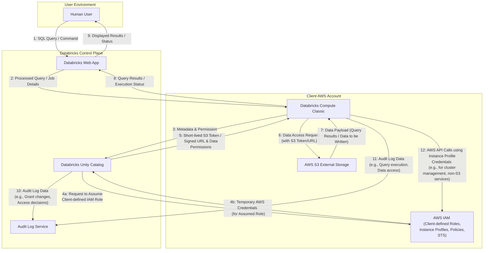

# Threat Model: Databricks Unity Catalog on AWS Data Access

## Section 1: Introduction

### 1.1 Purpose

To identify, analyze, and propose mitigations for potential security threats to the "Databricks Unity Catalog on AWS Data Access" system, focusing on ensuring the confidentiality, integrity, and availability of managed data.

### 1.2 System Overview

The "Databricks Unity Catalog on AWS Data Access" system enables authenticated human users to execute SQL queries and run code (which might create, read, modify, or delete data) over structured business data. This data includes sensitive information such as PII subject to GDPR, and is stored in the client's external S3 buckets on AWS. The system leverages Databricks Unity Catalog for centralized data governance, metadata management, and access control. Compute resources run under the classic Databricks model, meaning they are provisioned within the client's AWS account.

### 1.3 Scope

#### In Scope:
* The Databricks web user interface.
* Databricks infrastructure components directly involved in the query lifecycle with Unity Catalog.
* Relevant AWS components, including S3 for external storage and IAM for roles and instance profiles.
* Mechanisms for human user authentication to Databricks as they pertain to data access.
* Data access flows for queries originating from human users via SQL or programming languages.

#### Out of Scope:
* Access by external systems (beyond human users interacting with Databricks).
* The detailed processes for how data is initially sourced into the client's S3 buckets.
* Specific vulnerabilities within the underlying Databricks or AWS services, unless directly exploitable through the defined data access patterns. (We will assume these platforms provide their stated security features, and focus on their configuration and use).

### 1.4 Key Assumptions
* Users are already authenticated to the Databricks environment before attempting data access operations governed by Unity Catalog. (The specifics of this initial authentication are not the primary focus, but the authenticated identity is the input to Unity Catalog's decisions).
* The client's AWS environment and the Databricks control plane are configured according to their respective best practices, except where we might identify specific configuration-related threats.
* Data at rest in S3 is encrypted (details of encryption can be explored as a mitigation or existing control).

## Section 2: System Architecture Overview

The following Data Flow Diagram (DFD) illustrates the key components, system boundaries, and data flows for the "Databricks Unity Catalog on AWS Data Access" system.

### 2.1 Assets
The most valuable assets within this system are:
* The **data stored in `awsS3ExternalStorage`**, particularly the "external tables" which represent raw source system data.
* This data includes **PII under GDPR regulation**, making its confidentiality and integrity paramount.

## Section 3: Identified Threats and Mitigations

We will use the STRIDE framework as a guide to identify threats. For each threat, we will assess its Likelihood and Impact to determine an overall Risk level.

| Threat ID | Threat Description                                                                                                                               | Affected Asset(s) or Flow(s) | STRIDE Category      | Potential Impact | Assessed Likelihood | Assessed Risk | Agreed Mitigations & Controls | Status of Mitigation |
| :-------- | :----------------------------------------------------------------------------------------------------------------------------------------------- | :--------------------------- | :------------------- | :--------------- | :------------------ | :------------ | :-------------------------- | :------------------- |
| T001      | An attacker gains unauthorized read access to sensitive PII/GDPR data stored in `awsS3ExternalStorage` by exploiting misconfigured S3 bucket policies or ACLs, potentially bypassing some Unity Catalog intended controls. | Data in `awsS3ExternalStorage` (External Tables, raw source data including PII/GDPR) | Information Disclosure | High             | Medium   *Reason: S3 policies/ACLs not deployed via fully automated methods.* | High          | *To be discussed* | *To be discussed* |
| T002      | Short-lived S3 tokens or signed URLs, vended by Unity Catalog to `databricksComputeClassic`, are intercepted or leaked from the compute environment (e.g., through compromised compute resources, logs, or an insecure intermediary process). This could allow an attacker to replay these credentials to directly access S3 data within the token's scope and expiry window, bypassing other Databricks controls. | Flow 5, Credentials (S3 tokens/signed URLs), Data in `awsS3ExternalStorage` | Information Disclosure / Elevation of Privilege | High             | *To be assessed* | *To be assessed* | *To be discussed* | *To be discussed* |
| T003      | The client-defined IAM role that Databricks Unity Catalog assumes to access S3 (and potentially other services) is overly permissive. For example, it might grant `s3:*` on a wide range of buckets, or unnecessary permissions to other AWS services. If Unity Catalog's mechanisms for generating fine-grained credentials were ever flawed, or if an attacker found a way to abuse the assumed role session within Unity Catalog, these excessive permissions could be exploited, leading to broader data access or actions than intended by data governance policies. | Flow 4a/4b, `awsIAM` (Client-defined Role), all data/services accessible by the overly permissive role. | Elevation of Privilege | High             | Medium   *Reason: Based on vendor trust and designs to limit permissions available to UC.* | High          | *To be discussed* | *To be discussed* |
| T004      | The IAM Instance Profile attached to the EC2 instances within `databricksComputeClassic` is overly permissive. This could grant the compute nodes unnecessary access to unrelated AWS services or resources (e.g., broad S3 access not governed by Unity Catalog, permissions to modify other infrastructure, or access to sensitive configuration stores). If a compute node is compromised (e.g., through a vulnerability in the runtime or user code), an attacker could leverage these excessive instance profile permissions to escalate privileges or exfiltrate data outside of Databricks controls. | `databricksComputeClassic`, `awsIAM` (Instance Profile), any AWS resources/services accessible by the instance profile. | Elevation of Privilege | High             | Low   *Reason: The team is designing the permissions to be least privilege.* | Medium        | *To be discussed* | *To be discussed* |
| T005      | An attacker with sufficient privileges (e.g., a compromised administrative account for Databricks or the underlying cloud infrastructure where logs are stored) tampers with or deletes audit logs stored in the `AuditLogService`. This action could hide malicious activities, obstruct forensic investigations, and allow attackers to deny their actions, undermining accountability. | `AuditLogService`, Flows 10 & 11 (Audit Log Data). | Tampering / Repudiation | High             | Low   *Reason: Trust that Databricks will keep its audit logging secure.* | Medium        | *To be discussed* | *To be discussed* |
| T006      | Malicious code is introduced into the `databricksComputeClassic` environment via a compromised software package or library (e.g., Python/Scala library from PyPI/Maven, or a compromised dbt package). This malicious code could execute with the privileges of the Databricks job/notebook, potentially leading to data exfiltration, data tampering, credential theft, or denial of service. | `databricksComputeClassic`, Data in `awsS3ExternalStorage`, Credentials (Flow 5). | Tampering, Information Disclosure, Elevation of Privilege, Denial of Service | High             | *To be assessed* | *To be assessed* | *To be discussed* | *To be discussed* |
| T007      | A `HumanUser` interacts with the `DatabricksWebApp` using an end-user computing device (e.g., laptop, workstation) that is compromised (e.g., through malware, an unpatched OS) or is using an out-of-date/vulnerable web browser. This could lead to theft of the user's Databricks credentials or session hijacking, interception/modification of data/commands, exfiltration of sensitive data displayed to the user, or unauthorized actions performed within Databricks using the compromised user's session. | `HumanUser`, `DatabricksWebApp`, User's Databricks session/credentials, Flow 1, Flow 9. | Spoofing, Tampering, Information Disclosure | High             | *To be assessed* | *To be assessed* | *To be discussed* | *To be discussed* |
|           |                                                                                                                                                  |                              |                      |                  |                     |               |                             |                      |

## Section 4: Other Operational Considerations & Accepted Risks

This section outlines other operational security considerations relevant to the "Databricks Unity Catalog on AWS Data Access" system and documents any risks that have been formally accepted.

### 4.1 Operational Considerations
* *(To be discussed. This may include items such as data backup and recovery procedures specific to the external tables, incident response playbooks for data breaches involving this data, security awareness training for users, ongoing monitoring requirements, etc.)*

### 4.2 Accepted Risks
* *(No risks have been formally accepted at this stage. Risk acceptance will be documented here if, after assessment and consideration of potential mitigations, a decision is made to accept a specific risk.)*

## Section 5: Conclusion

### 5.1 Summary of Exercise

This threat modeling exercise for the "Databricks Unity Catalog on AWS Data Access" system has so far involved:
* Defining the scope, primary purpose, and key components of the system.
* Developing a Data Flow Diagram (DFD) to illustrate the system architecture and data flows.
* Identifying key assets, notably the sensitive PII/GDPR data stored in external S3 buckets.
* Initiating the threat identification process using the STRIDE framework, resulting in a preliminary list of potential threats with initial impact assessments. Several threats have had their likelihood and overall risk levels assessed, while others require further information.

The identified threats cover areas such as direct storage misconfigurations, credential security, permissions management for IAM roles and instance profiles, audit logging integrity, software supply chain vulnerabilities, and end-user device security.

### 5.2 Recommendations for Ongoing Review & Next Steps

To ensure the continued security of the "Databricks Unity Catalog on AWS Data Access" system, the following are recommended:

* **Complete Likelihood and Risk Assessment:** Gather the necessary information to finalize the likelihood and overall risk assessment for threats T002, T006, and T007.
* **Mitigation Planning:** Proceed to Phase 4 to brainstorm, evaluate, and agree on mitigation strategies for all threats rated as Medium risk or higher. Document these mitigations and their implementation status in Section 3 of this document.
* **Revisit Accepted Risks:** If any risks are formally accepted after mitigation analysis, ensure they are documented in Section 4.2.
* **Regular Review:** This threat model should be treated as a living document. It should be reviewed and updated periodically (e.g., annually, or upon significant changes to the system architecture, data sensitivity, or the threat landscape).
* **Integrate with Security Practices:** Ensure that findings and mitigations from this threat model are integrated into ongoing security operations, including monitoring, incident response, and vulnerability management processes.
* **Address Operational Considerations:** Populate Section 4.1 with relevant operational security considerations as they are identified or implemented.

This exercise has laid the groundwork for a more comprehensive understanding and management of security risks associated with this system. The next crucial steps involve defining and implementing appropriate mitigations and establishing a cycle of continuous review.